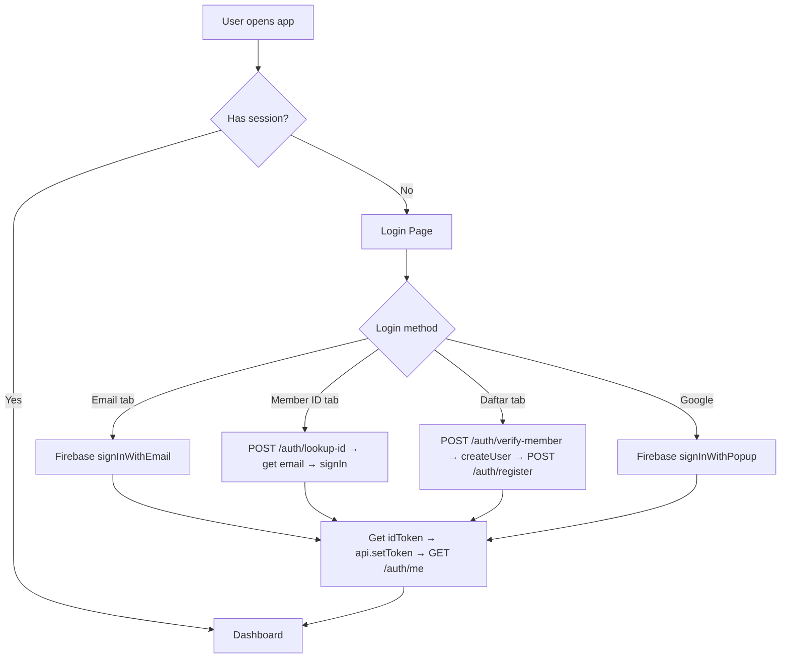

# DESIGN.md — NEWGAME Platform Design Document
> UKM Game Development, Universitas Andalas  
> v0.1.4 · Last Updated: 14 Juni 2026

---

## 1. Arsitektur Platform

```
┌──────────────────────────────────────────────────────────────────┐
│                    NEWGAME Platform Stack                        │
├──────────────┬───────────────────┬───────────────────────────────┤
│   FRONTEND   │     BACKEND       │         SERVICES              │
│   Next.js    │     NestJS        │                               │
│   Port 3000  │     Port 3001     │                               │
│              │                   │   Firebase Auth               │
│  Landing     │  /api/auth/*      │   Firebase Firestore          │
│  Login       │  /api/members/*   │   Cloudinary (media)          │
│  Dashboard   │  /api/attendance/*│   Upstash Redis (rate limit)  │
│  Leaderboard │  /api/xp/*        │   PostHog (analytics)         │
│  Badges      │  /api/events/*    │   Vercel (hosting)            │
│  News        │  /api/news/*      │                               │
│  Calendar    │  /api/badges/*    │                               │
│  Logs        │  /api/logs/*      │                               │
│  Admin       │  /api/export/*    │                               │
│  Profile     │  /api/media/*     │                               │
│  Members     │  /api/notifications│                              │
│  Scan (QR)   │  /api/ai/*        │                               │
└──────────────┴───────────────────┴───────────────────────────────┘
```

### Deployment
- **Frontend**: `unandnewgame-tan.vercel.app` (Next.js SSR)
- **Backend API**: `api.unandnewgame.vercel.app` (NestJS → Vercel Serverless)
- **API Proxy**: Next.js rewrites `/api/*` → backend (dev + production)

### Monorepo Structure
```
web-ua-newgame/
├── apps/
│   ├── web/          ← Next.js 14 (frontend)
│   └── api/          ← NestJS (backend)
├── tools/
│   └── mobile-simulator/  ← Flutter Android WebView
├── scripts/          ← Migration, backup
├── storage/          ← Asset storage docs
└── docs/
    ├── TODO.md
    ├── DESIGN.md      ← This file
    ├── CHANGELOG.md
    ├── SECURITY.md
    └── ...
```

---

## 2. Design System

### 2.1 Color Palette (Dark Mode Primary)

| Token                    | Value                    | Usage                          |
|--------------------------|--------------------------|--------------------------------|
| `--clr-bg`               | `#0d1117`                | Page background                |
| `--clr-bg-surface`       | `rgba(22,27,34,0.85)`    | Card surfaces                  |
| `--clr-bg-muted`         | `rgba(33,38,45,0.6)`     | Inputs, secondary surfaces     |
| `--clr-gold`             | `#fdcf41`                | Primary accent (CTA, XP)       |
| `--clr-gold-dim`         | `#c9a227`                | Text on dark bg                |
| `--clr-gold-glow`        | `rgba(253,207,65,0.12)`  | Glow effects                   |
| `--clr-lavender`         | `#b9a6ce`                | Secondary accent               |
| `--clr-ink`              | `#12121a`                | Deep dark / buttons            |
| `--clr-text-primary`     | `#e6edf3`                | Primary text                   |
| `--clr-text-secondary`   | `#8b949e`                | Muted text                     |
| `--clr-border`           | `rgba(48,54,61,0.6)`     | Borders                        |
| `--clr-success`          | `#22c55e`                | Success states                 |
| `--clr-danger`           | `#ef4444`                | Error states                   |
| `--clr-warning`          | `#f59e0b`                | Warning states                 |
| `--clr-info`             | `#3b82f6`                | Info states                    |

### 2.2 Typography

| Font              | Usage                          | Import              |
|-------------------|--------------------------------|----------------------|
| **Lora**          | Headings, display text         | Google Fonts         |
| **Inter**         | Body text, labels, UI          | Google Fonts         |
| **Cormorant**     | Decorative, subtitles          | Google Fonts         |
| **Space Grotesk** | Landing page hero typewriter   | Google Fonts         |

### 2.3 Spacing Scale

```css
--space-xs:  4px;
--space-sm:  8px;
--space-md:  12px;
--space-lg:  16px;
--space-xl:  24px;
--space-2xl: 32px;
--space-3xl: 48px;
```

### 2.4 Radius Scale

```css
--radius-sm:   6px;
--radius-md:   10px;
--radius-lg:   16px;
--radius-full: 9999px;
```

### 2.5 Animation Principles
- **Transition duration**: 0.2–0.3s for micro-interactions
- **Easing**: `cubic-bezier(0.4, 0, 0.2, 1)` (Material ease)
- **Page entrance**: `animate-fade-in` (opacity 0→1, translateY 8→0, 0.4s)
- **Spring modals**: `animate-spring-modal` (scale 0.92→1, spring bounce)
- **Float**: `animate-float` (translateY ±6px, infinite, 3s)
- **Hover lift**: `translateY(-4px)` + `box-shadow` elevation

### 2.6 Component Patterns

| Component         | Pattern                                    |
|-------------------|--------------------------------------------|
| **Card**          | `.card` — glassmorphism, border, radius-lg  |
| **Button**        | `.btn .btn-primary .btn-depth` — gold accent|
| **Badge**         | `.badge .badge-green/red/gray/blue/purple`  |
| **Input**         | `.input` — dark bg, border, focus glow      |
| **Table**         | `.table` inside `.table-container`          |
| **Skeleton**      | `.skeleton` — shimmer loading placeholder   |
| **Toast**         | ARIA live region, auto-dismiss 5s           |
| **Modal**         | `.modal-backdrop` + `.modal-box`            |
| **Filter Pill**   | `.filter-pill .active` — gold glow active   |

---

## 3. Page Inventory & Status

### 3.1 Public Pages
| Page        | Route         | Status | Notes                          |
|-------------|---------------|--------|--------------------------------|
| Landing     | `/landing`    | ✅     | Hero + PirateMap + Pillars     |
| Login       | `/login`      | ✅     | 3-tab: Email/MemberID/Daftar  |
| Root        | `/`           | ✅     | Auth check → redirect          |

### 3.2 Dashboard Pages
| Page          | Route                 | Status | Notes                                |
|---------------|-----------------------|--------|--------------------------------------|
| Dashboard     | `/dashboard`          | ✅     | Yua hero, stats, quick actions       |
| Leaderboard   | `/leaderboard`        | ✅     | Podium + full table                  |
| Badges        | `/badges`             | ✅     | Collection grid, rarity system       |
| News          | `/news`               | ✅     | Articles + tutorials, tabs           |
| Calendar      | `/calendar`           | ✅     | Grid + event sidebar                 |
| Scan          | `/scan`               | ✅     | QR scanner, offline queue            |
| Profile       | `/profile`            | ✅     | Avatar, form, multi-avatar selector  |
| Members       | `/members`            | ✅     | Table/card/division views            |
| Logs          | `/logs`               | ✅     | Filter + export                      |
| Admin         | `/admin`              | ✅     | Members, roles, news, media          |
| Change Pass   | `/change-password`    | ✅     | Firebase password change             |
| Pirate Map    | `/pirate-map`         | ✅     | Learning roadmap                     |

---

## 4. Role Hierarchy

```
Level 8: pixel presiden     ← Full platform control
Level 7: code commander     ← Technical admin
Level 6: gold guardian      ← Financial admin
Level 5: quest keeper       ← Event management
Level 4: inventori          ← Asset management
Level 3: admin              ← Content management
Level 2: member             ← Regular member
Level 1: npc                ← Spectator/read-only
```

---

## 5. Auth Flow



---

## 6. Implementation Plan — 4 Batches

### Batch 1: Auth & Core UX (Priority: Critical)
> Fokus: User bisa masuk, daftar, dan recover akun

| # | Task | Type | Files |
|---|------|------|-------|
| 1 | Forgot password page | Frontend | `apps/web/src/app/forgot-password/page.tsx` |
| 2 | Email verification resend button | Frontend | `apps/web/src/app/login/page.tsx` |
| 3 | Profile edit form (bio, GitHub, skills) | Both | `profile/page.tsx` + `PATCH /users/profile` |
| 4 | SEO meta tags all pages | Frontend | All `page.tsx` + `layout.tsx` |
| 5 | Member search frontend | Frontend | `members/page.tsx` (already has client-side!) |
| 6 | Article search frontend | Frontend | `news/page.tsx` + API `?search=` |
| 7 | Toast queue system | Frontend | `components/ui/Toast.tsx` |

**Estimasi**: ~7 file baru/dimodifikasi

---

### Batch 2: Admin & Export (Priority: High)
> Fokus: Admin bisa export data dan manage events

| # | Task | Type | Files |
|---|------|------|-------|
| 8 | Export members CSV | Backend | `modules/export/export.controller.ts` |
| 9 | Export attendance CSV | Backend | `modules/export/export.controller.ts` |
| 10 | Export logs CSV | Both | `logs/page.tsx` + backend |
| 11 | Admin event creation form | Frontend | `admin/page.tsx` (tambah tab Events) |
| 12 | Admin attendance report | Frontend | `admin/page.tsx` (tambah tab Attendance) |
| 13 | Log filter by type + date | Both | `logs/page.tsx` + backend (sudah ada!) |
| 14 | Manual attendance input | Backend | `attendance.controller.ts` |

**Estimasi**: ~6 file baru/dimodifikasi

---

### Batch 3: Feature Enhancement (Priority: Medium)
> Fokus: Polish UX dan fitur yang diharapkan user

| # | Task | Type | Files |
|---|------|------|-------|
| 15 | Badge detail modal | Frontend | `badges/page.tsx` |
| 16 | Leaderboard generation filter | Both | `leaderboard/page.tsx` + API |
| 17 | Event display on calendar | Frontend | `calendar/page.tsx` (fix rendering) |
| 18 | Announcement banner | Both | `dashboard/page.tsx` + API |
| 19 | Member profile click-through | Frontend | `members/[uid]/page.tsx` (new) |
| 20 | Media gallery listing | Backend | `media.controller.ts` |

**Estimasi**: ~6 file baru/dimodifikasi

---

### Batch 4: Polish & Docs (Priority: Low)
> Fokus: Nice-to-have dan dokumentasi

| # | Task | Type | Files |
|---|------|------|-------|
| 21 | Download profile as image | Frontend | `profile/page.tsx` |
| 22 | Article categories/tags | Both | `news/` backend + frontend |
| 23 | Admin bulk import UI | Frontend | `admin/page.tsx` |
| 24 | Deployment runbook | Docs | `DEPLOYMENT.md` |
| 25 | Weekly activity heatmap | Frontend | `dashboard/page.tsx` |

**Estimasi**: ~5 file baru/dimodifikasi

---

## 7. Excluded — Requires External Setup

Berikut item yang **tidak bisa dikerjakan tanpa akses/setup manual**:

| Category | Items |
|----------|-------|
| **Infrastructure** | Docker Compose, staging env, WebSocket server |
| **API Keys** | SendGrid email, Cloudinary video, Milvus/Zilliz |
| **Firebase Console** | Email template config, production seed |
| **Business Rules** | XP decay, late penalty, streak bonus, leave system |
| **Advanced Security** | PQCrypto, secret rotation, SIEM, anomaly alerting |
| **Production Ops** | Prisma migrate, role migration, GitHub secrets |
| **Major Features** | i18n, global search (Cmd+K), Better Auth migration |

---

## 8. Design Principles

1. **Dark-First**: Semua UI dirancang untuk dark mode. Light mode opsional.
2. **Gamification**: XP, levels, badges, streaks — setiap interaksi terasa rewarding.
3. **Mobile-Ready**: Responsive breakpoint 768px + Flutter WebView untuk Android.
4. **Indonesian-First**: Semua copy dalam Bahasa Indonesia, error messages jelas.
5. **Offline-Resilient**: QR scan queue, IndexedDB session cache, graceful fallbacks.
6. **Accessibility**: ARIA labels, keyboard navigation, focus indicators.
7. **Performance**: Skeleton loading, optimistic UI, asset caching headers.

---

*NEWGAME v0.1.4 — UKM Game Development, Universitas Andalas*
