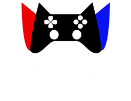

<div align="center">
  

  <h1>NEWGAME</h1>
  <p>Platform web UKM Game Development — Universitas Andalas</p>

  <p>
    
    
    
    
    <a href="https://unandnewgame-tan.vercel.app"></a>
    <a href="https://unandnewgame.vercel.app"></a>
  </p>
</div>

---

## Tentang

NEWGAME adalah platform manajemen organisasi berbasis web untuk UKM Game Development Universitas Andalas. Sistem ini menggabungkan:

- **Absensi QR Code** — scan langsung dari browser
- **Gamifikasi** — setiap kehadiran = EXP, naik level, bersaing di leaderboard
- **Dashboard Admin** — manajemen anggota, event, media, roles, analytics
- **Landing Page** — informasi publik tentang UKM

Dibangun sebagai **monorepo**: frontend Next.js 14 + backend NestJS 10, keduanya TypeScript, deploy ke Vercel.

---

## URL Produksi

| Layanan | URL | Keterangan |
|---|---|---|
| 🌐 **Web App** | [`unandnewgame-tan.vercel.app`](https://unandnewgame-tan.vercel.app) | Next.js frontend |
| 🌐 **Landing** | [`unandnewgame-tan.vercel.app/landing`](https://unandnewgame-tan.vercel.app/landing) | Halaman publik |
| 🔐 **Login** | [`unandnewgame-tan.vercel.app/login`](https://unandnewgame-tan.vercel.app/login) | Portal masuk |
| ⚙️ **API** | [`unandnewgame.vercel.app/api`](https://unandnewgame.vercel.app/api) | NestJS REST API |
| ❤️ **API Health** | [`unandnewgame.vercel.app/health`](https://unandnewgame.vercel.app/health) | Status API |

> `unandnewgame.vercel.app` (root) otomatis redirect ke landing page.

---

## Akun & Role

### Tipe Akun

| Role | Kemampuan |
|---|---|
| `member` | Scan absensi, dashboard XP/level, leaderboard, profil, berita |
| `admin` | Semua member + buat event, generate QR token, manajemen berita & media |
| `superadmin` | Semua admin + manajemen role, analytics, export, log audit |

### Cara Daftar (Anggota Baru)

1. Buka [`/login`](https://unandnewgame-tan.vercel.app/login)
2. Klik **"Daftar Akun"**
3. Masukkan **Member ID** dan **Kode Akses** yang diperoleh dari admin
4. Login menggunakan Google (email kampus)

> ⚠️ Registrasi memerlukan Member ID + Kode Akses dari admin. Tanpa itu, akun tidak bisa dibuat.

### Cara Admin Membuat Member Baru

1. Buka Firebase Console → Firestore → koleksi `members`
2. Tambahkan dokumen baru dengan field:
   ```
   memberId    : "NIM-atau-ID-unik"
   accessCode  : "kode-rahasia"
   name        : "Nama Lengkap"
   division    : "nama-divisi"
   role        : "member"
   ```
3. Bagikan `memberId` dan `accessCode` ke anggota baru

Lihat [`ACCOUNT_GUIDE.md`](./ACCOUNT_GUIDE.md) untuk panduan lengkap.

---

## Stack Teknologi

| Layer | Teknologi |
|---|---|
| Frontend | Next.js 14, TypeScript, Vanilla CSS |
| Backend | NestJS 10, TypeScript |
| Database | Cloud Firestore |
| Auth | Firebase Authentication + Google OAuth |
| Storage | Cloudinary |
| AI | OpenAI, Groq SDK |
| Deploy | Vercel (web + api project terpisah) |

---

## Struktur Proyek

```
web-ua-newgame/
├── apps/
│   ├── api/                    Backend NestJS
│   │   ├── api/
│   │   │   └── index.js        Serverless entry point (Vercel)
│   │   └── src/
│   │       ├── app.controller.ts  Root redirect → landing
│   │       ├── app.module.ts
│   │       ├── modules/
│   │       │   ├── auth/       Login, register, token
│   │       │   ├── users/      Profile, roles
│   │       │   ├── attendance/ QR absensi
│   │       │   ├── xp/         Gamifikasi EXP
│   │       │   ├── badges/     Achievement badges
│   │       │   ├── events/     Kalender event
│   │       │   ├── news/       Berita & blog
│   │       │   ├── media/      Upload foto, avatar
│   │       │   ├── dashboard/  Analytics dashboard
│   │       │   ├── ai/         AI assistant
│   │       │   └── ...
│   │       ├── firebase/       Firebase Admin SDK
│   │       └── common/         Guards, decorators
│   │
│   └── web/                    Frontend Next.js
│       ├── public/
│       │   ├── logo.png        Logo NEWGAME
│       │   └── yua.png         Karakter maskot
│       └── src/
│           ├── app/
│           │   ├── landing/    Halaman publik
│           │   ├── login/      Autentikasi
│           │   └── dashboard/  Portal anggota
│           ├── components/     Shared components
│           ├── lib/
│           │   ├── api.ts      HTTP client
│           │   ├── auth-store.ts  Zustand auth state
│           │   └── firebase.ts    Firebase client
│           └── styles/
│               └── globals.css    Design token system
│
├── ACCOUNT_GUIDE.md            Panduan daftar akun
├── CHANGELOG.md                Riwayat perubahan
├── DEVELOPER_GUIDE.md          Panduan developer
├── SECURITY.md                 Kebijakan keamanan
└── vercel.json                 Konfigurasi deploy API
```

---

## Setup Lokal

**Prasyarat:** Node.js 18+, akun Firebase, akun Cloudinary.

```bash
git clone https://github.com/rannymphaea/web-ua-newgame.git
cd web-ua-newgame
npm install --legacy-peer-deps
```

### Environment Variables

**Frontend** — buat `apps/web/.env.local`:

```env
NEXT_PUBLIC_FIREBASE_API_KEY=your_key
NEXT_PUBLIC_FIREBASE_AUTH_DOMAIN=your_project.firebaseapp.com
NEXT_PUBLIC_FIREBASE_PROJECT_ID=your_project_id
NEXT_PUBLIC_FIREBASE_MESSAGING_SENDER_ID=your_sender_id
NEXT_PUBLIC_FIREBASE_APP_ID=your_app_id
NEXT_PUBLIC_API_URL=http://localhost:3001/api
```

**Backend** — buat `apps/api/.env`:

```env
PORT=3001
FRONTEND_URL=http://localhost:3000
WEB_URL=http://localhost:3000
FIREBASE_PROJECT_ID=your_project_id
FIREBASE_STORAGE_BUCKET=your_project.appspot.com
GOOGLE_APPLICATION_CREDENTIALS=serviceAccountKey.json
CLOUDINARY_CLOUD_NAME=your_cloud_name
CLOUDINARY_API_KEY=your_api_key
CLOUDINARY_API_SECRET=your_api_secret
OPENAI_API_KEY=sk-...        # Opsional, untuk fitur AI
GROQ_API_KEY=gsk_...         # Opsional, untuk fitur AI
```

### Jalankan Dev Server

```bash
# Terminal 1 — Backend API (port 3001)
npm run dev --workspace=apps/api

# Terminal 2 — Frontend Web (port 3000)
npm run dev --workspace=apps/web
```

Buka [http://localhost:3000/landing](http://localhost:3000/landing).

---

## Deployment (Vercel)

Proyek ini menggunakan **dua Vercel project** dari satu repository:

### Web Project (`unandnewgame`)

1. Import repo → Root Directory: `apps/web`
2. Framework: Next.js (auto-detect)
3. Environment variables: semua `NEXT_PUBLIC_*` + `NEXT_PUBLIC_API_URL` (URL API production)

### API Project (`web-ua-newgame-api`)

1. Import repo → Root Directory: `.` (root)
2. Gunakan `vercel.json` yang sudah ada
3. Environment variables:
   - `FIREBASE_PROJECT_ID`, `FIREBASE_STORAGE_BUCKET`
   - `FIREBASE_CREDENTIALS_JSON` ← isi **seluruh konten** `serviceAccountKey.json` (bukan path file!)
   - `CLOUDINARY_*`
   - `WEB_URL` = URL web production (agar redirect root → landing benar)

### Deploy Manual

```bash
# Deploy API
npx vercel --prod

# Deploy Web
npx vercel --cwd apps/web --prod
```

---

## Fitur Lengkap

**Portal Anggota:**
- Scan QR Code absensi dari kamera browser
- Dashboard XP, level, streak, rank, badge real-time
- Leaderboard global & per-divisi
- Upload foto profil & pilih avatar (Default / α Alpha / Ω Omega / Yua)
- Baca berita & pengumuman UKM
- Kalender event & notifikasi
- Ganti password

**Portal Admin:**
- Buat event & generate QR token absensi
- Analytics kehadiran & deteksi anomali otomatis
- Manajemen berita, media & galeri
- Ekspor laporan kehadiran (CSV)
- Log aktivitas sistem (audit trail)

**Portal Superadmin:**
- Semua fitur admin
- Manajemen role anggota (member / admin / superadmin)
- AI assistant untuk analisis data

---

## Lisensi

MIT © 2025 NEWGAME — Universitas Andalas

---

<div align="center">
  <sub>
    <a href="https://www.instagram.com/unandnewgame">Instagram</a> ·
    <a href="https://youtube.com/@unandnewgame">YouTube</a> ·
    <a href="mailto:unandnewgame@gmail.com">Email</a>
  </sub>
</div>